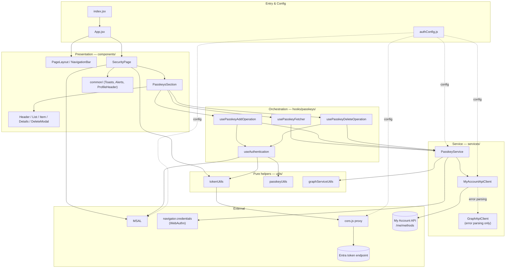

# Architecture

This document describes the structure of the **`passkey-sample`** app: where it
lives in the repository, how its folders and files are organised, the layered
architecture, and a reference of every module and the functions/components
("classes") it exports.

---

## 1. Where this app sits in the repository

The repository (`ms-identity-ciam-native-javascript-samples`) hosts **several
independent samples**. Only `passkey-sample/` implements passkey management with
the Graph WebAuthn/FIDO2 APIs; the others demonstrate Native Authentication
(sign‑in / sign‑up / OTP) and supporting infrastructure.

```text
ms-identity-ciam-native-javascript-samples/
├── passkey-sample/        ← THIS app: React SPA for passkey management (focus of these docs)
├── API/                   Native Authentication via direct REST API calls
│   ├── React/             ReactAuthSimple, ReactAuthOTPSimple, ReactAuthStateManagementAndUI
│   └── CORSTestEnviroment/ Reverse‑proxy samples (Azure Function / ARM template)
├── typescript/native-auth/ Native Auth via the SDK
│   ├── react-nextjs-sample/
│   └── angular-sample/
└── README.md              Repo overview of all samples
```

> The rest of this document is **only about `passkey-sample/`**.

---

## 2. Folder & file map

```text
passkey-sample/
├── index.html                  Vite HTML entry (mounts #root)
├── vite.config.js              Dev server: HTTPS certs, host/port from .env
├── cors.js                     Local CORS proxy → login.microsoftonline.com (token endpoint)
├── package.json                Dependencies + scripts (start / build / cors)
├── .env(.example)              Local host, port, cert paths, VITE_APP_SECRET
├── auth-cert.pem / auth-key.pem  Self‑signed cert for local HTTPS (generated, gitignored)
├── public/                     Static assets (favicon.svg, manifest.json)
└── src/
    ├── index.jsx               App bootstrap: create MSAL, handle redirect, render <App>
    ├── App.jsx                 Root component (MsalProvider → PageLayout → MainContent)
    ├── authConfig.js           msalConfig, loginRequest (ngcmfa claims), appConfig
    ├── constants.js            Test-only BEARER_TOKEN (paste an externally-acquired API token)
    │
    ├── components/             ── PRESENTATION LAYER (React UI) ──
    │   ├── PageLayout.jsx          Shell: NavigationBar + auth‑gated children
    │   ├── NavigationBar.jsx       Sign in / Sign out buttons
    │   ├── SecurityPage.jsx        Authed orchestrator: tokens, ngcmfa, toasts, layout
    │   ├── common/
    │   │   ├── UIComponents.jsx        SecurityAlert, UserProfileHeader
    │   │   ├── ToastNotifications.jsx  ToastNotifications + ToastItem
    │   │   └── index.js                Barrel re‑exports
    │   └── passkeys/
    │       ├── PasskeysSection.jsx     Feature container: wires hooks → sub‑components
    │       ├── index.js                Barrel re‑export
    │       └── components/             Presentational passkey sub‑components
    │           ├── PasskeysHeader.jsx      Count "(n/max)" + Add button
    │           ├── PasskeysList.jsx        Loading / empty / error / list states
    │           ├── PasskeyItem.jsx         One passkey row (expandable)
    │           ├── PasskeyDetails.jsx      Expanded details (date, AAGUID)
    │           ├── DeleteModal.jsx         Delete confirmation dialog
    │           └── utils.js                parseDeviceModel()
    │
    ├── hooks/passkeys/         ── ORCHESTRATION LAYER (state + logic) ──
    │   ├── useAuthentication.js         Sign‑in redirect, MFA check, cache/resume op
    │   ├── usePasskeyFetcher.js         Fetch w/ retry; passkeys/isLoading/error state
    │   ├── usePasskeyAddOperation.js    Add flow (MFA gate → WebAuthn → register)
    │   ├── usePasskeyDeleteOperation.js Delete flow (MFA gate → modal → delete)
    │   └── index.js                     Barrel re‑exports
    │
    ├── services/              ── SERVICE LAYER (Graph + WebAuthn) ──
    │   ├── PasskeyService.js            FIDO2 operations (creationOptions/register/fetch/delete)
    │   ├── MyAccountApiClient.js        My Account API client (GET /me/methods) — migration target
    │   └── GraphApiClient.js            Generic Graph HTTP client + error parsing
    │
    ├── utils/                 ── PURE HELPERS ──
    │   ├── tokenUtils.js                JWT parse, token acquisition + caching, ngcmfa expiry
    │   ├── passkeyUtils.js              Constants, retry delays, toast message factory
    │   └── graphServiceUtils.js         base64url <-> buffer, formatting, transform
    │
    └── styles/                App.css, index.css
```

---

## 3. Layered architecture

The app follows a **strict one‑directional dependency flow**. UI never talks to
Graph directly; each layer only depends on the layer beneath it.



### Layer responsibilities

| Layer | Folder | Responsibility | Must **not** do |
| ----- | ------ | -------------- | --------------- |
| **Entry & Config** | `index.jsx`, `App.jsx`, `authConfig.js` | Bootstrap MSAL, wire providers, hold configuration. | Contain feature logic. |
| **Presentation** | `components/` | Render state, capture user intent, local view state only. | Call Graph or MSAL token APIs (except sign‑in buttons / `useMsal`). |
| **Orchestration** | `hooks/passkeys/` | Own React state, sequence operations, enforce the MFA gate, surface toasts. | Build HTTP requests or encode WebAuthn payloads. |
| **Service** | `services/` | Translate intent into My Account API calls + WebAuthn ceremonies. | Hold React state. |
| **Pure helpers** | `utils/` | Stateless transforms, encoding, token/JWT helpers, constants. | Import React or components. |

---

## 4. Authentication & token model (important)

The app uses **two distinct tokens** — this is the most surprising part of the
design, so it is worth calling out explicitly:

| Token | Acquired by | Flow | Used for |
| ----- | ----------- | ---- | -------- |
| **User access token** | `tokenUtils.getAccessToken` via MSAL `acquireTokenSilent` | Delegated, in‑browser, with `ngcmfa` claim | Identifying the user (`oid` → `userId`) and computing the **NGCMFA expiry** that gates passkey changes. |
| **App / API token** | `tokenUtils.getCachedAppToken` → `cors.js` proxy | Client‑credentials (app permission `UserAuthMethod-Passkey.ReadWrite.All`) | The **Bearer token on every My Account API call** in `MyAccountApiClient`. |

* The browser cannot hit the Entra token endpoint directly (CORS), so the
  client‑credentials request is proxied through **`cors.js`** (`/api` →
  `login.microsoftonline.com/{tenantId}`). My Account API calls go **directly**
  from the browser and are not proxied.
* **Testing override:** paste a token into `src/constants.js` (`BEARER_TOKEN`).
  When set, `SecurityPage` uses it directly as the API token and **skips** the
  client‑credentials acquisition (no client secret / CORS proxy required). This is
  the intended way to supply an externally‑acquired `/me` user token for testing.
* **NGCMFA gate:** `loginRequest` requests an `ngcmfa` amr claim. `SecurityPage`
  computes an expiry (`iat + 15 min`). Before an add/delete, the operation hooks
  check `isTokenExpired`; if expired they **cache the intended operation** in
  `sessionStorage` and trigger an interactive re‑auth, then resume after redirect.

See [DATA-FLOWS.md](./DATA-FLOWS.md) for the full sequences.

---

## 5. Module reference ("classes")

This codebase is functional React (hooks + exported functions) rather than OO
classes. The tables below list each module's exported **functions / components**
and their role.

### 5.1 Entry & configuration

| Module | Exports | Role |
| ------ | ------- | ---- |
| `src/index.jsx` | *(bootstrap)* | Creates `PublicClientApplication`, sets active account, runs `handleRedirectPromise`, then renders `<App>`. |
| `src/App.jsx` | `App`, `MainContent` | `App` wraps `MsalProvider` → `PageLayout`. `MainContent` renders `SecurityPage` only when authenticated. |
| `src/authConfig.js` | `msalConfig`, `loginRequest`, `appConfig` | MSAL config; `loginRequest` injects the `ngcmfa` claims; `appConfig` holds `proxyDomain`, `appId`, `tenantId`, `customDomain`. |
| `vite.config.js` | *(default config)* | Dev server with HTTPS (cert/key from `.env`), host/port from `.env`. |
| `cors.js` | *(Node server)* | Local proxy: forwards `/api/*` to `login.microsoftonline.com/{tenantId}` with permissive CORS (dev only). |

### 5.2 Presentation — `components/`

| Module | Exports | Role |
| ------ | ------- | ---- |
| `PageLayout.jsx` | `PageLayout` | App shell: `NavigationBar` + unauthenticated welcome + children. |
| `NavigationBar.jsx` | `NavigationBar` | Sign‑in / sign‑out redirects; clears app‑token cache on logout. |
| `SecurityPage.jsx` | `SecurityPage` | **Authed orchestrator**: acquires both tokens, computes NGCMFA expiry, derives `userId`/profile, owns the toast queue, renders profile + `PasskeysSection` + `ToastNotifications`. |
| `common/UIComponents.jsx` | `SecurityAlert`, `UserProfileHeader` | Reusable info banner and profile header. |
| `common/ToastNotifications.jsx` | `ToastNotifications` (default), `ToastItem` | Toast container (top‑right + centered MFA toast) and individual auto‑hiding toast with optional action button. |
| `common/index.js` | re‑exports | Barrel for the `common` components. |
| `passkeys/PasskeysSection.jsx` | `PasskeysSection` (default) | **Feature container**: instantiates the four hooks and wires their state/handlers into the header, list, and delete modal; triggers initial fetch and resumes any cached post‑login operation. |
| `passkeys/index.js` | re‑export | Barrel for `PasskeysSection`. |
| `passkeys/components/PasskeysHeader.jsx` | `PasskeysHeader` (default) | Shows `count/maxCount` and the Add button (disabled at max / while loading). |
| `passkeys/components/PasskeysList.jsx` | `PasskeysList` (default) | Renders error / loading / empty / populated list of `PasskeyItem`. |
| `passkeys/components/PasskeyItem.jsx` | `PasskeyItem` (default) | One passkey row with delete button and expand toggle. |
| `passkeys/components/PasskeyDetails.jsx` | `PasskeyDetails` (default) | Expanded panel: registration date + AAGUID. |
| `passkeys/components/DeleteModal.jsx` | `DeleteModal` (default) | Confirm/cancel dialog for deletion. |
| `passkeys/components/utils.js` | `parseDeviceModel` | Splits a model string into `{ authenticatorDevice, method }`. |

### 5.3 Orchestration — `hooks/passkeys/`

| Hook | Returns | Role |
| ---- | ------- | ---- |
| `useAuthentication` | `handleSignIn`, `handleReAuthentication`, `isTokenExpired`, `cacheOperation`, `getCachedOperation`, `clearCachedOperation` | Sign‑in/re‑auth redirects, NGCMFA expiry check, and persisting/restoring the pending operation across the re‑auth redirect (`sessionStorage` `postLoginAction`). |
| `usePasskeyFetcher` | `passkeys`, `isLoading`, `error`, `fetchPasskeys`, `refetch` | Fetches and transforms passkeys with **retry + expected‑change validation** (e.g. wait until count increases after an add, or the id disappears after a delete). |
| `usePasskeyAddOperation` | `handleAddPasskey`, `performAddPasskey` | Add flow: MFA gate → `startPasskeyEnrollment` (POST `/me/methods/fido`) → `registerUserPasskey` (WebAuthn → POST `activate`) → re‑fetch; handles `NotAllowedError`. |
| `usePasskeyDeleteOperation` | `initiate`, `performDelete`, `showConfirmationModal`, `modalProps` | Delete flow: MFA gate → confirm modal → `deleteUserPasskey` (DELETE `/me/methods/fido/{id}`) → re‑fetch; owns modal visibility state. |
| `index.js` | re‑exports | Barrel for all four hooks. |

### 5.4 Service — `services/`

| Module | Exports | Role |
| ------ | ------- | ---- |
| `PasskeyService.js` | `startPasskeyEnrollment`, `registerUserPasskey`, `fetchUserPasskey`, `deleteUserPasskey` | High‑level FIDO2 operations, **all on the My Account API**. `createCredential` runs the WebAuthn ceremony (`navigator.credentials.create`) and `activatePasskey` POSTs the attestation to the activation link. |
| `MyAccountApiClient.js` | `myAccountGet`, `myAccountPost`, `myAccountDelete` | HTTP boundary to the **My Account API** (`https://login.microsoftonline.com/{tenantId}/api/v1.0`). Sends `Content-Type: application/hal+json` + `Allow`, the Bearer token, and the hardcoded test query params (`dc`, `myaccessgrpccanary`). `buildUrl` accepts either a path or a full HAL `href` (it strips a duplicate `/api/v1.0`). |
| `GraphApiClient.js` | `makeGraphRequest`, `graphGet`, `graphPost`, `graphDelete`, `parseGraphApiError` | Legacy Microsoft Graph client. Now only `parseGraphApiError` is used (by `MyAccountApiClient` for error normalisation); the verb helpers are no longer wired into any flow. |

**Endpoints used** (all on the My Account API, base `https://login.microsoftonline.com/{tenantId}/api/v1.0`, with `?dc=…&myaccessgrpccanary=true`):

| Operation | Method & path |
| --------- | ------------- |
| List passkeys | `GET /me/methods` |
| Start enrollment | `POST /me/methods/fido` |
| Activate (complete) | `POST {_links.activate.href}` → `/me/methods/fido/{id}/activate` |
| Delete passkey | `DELETE {_links.delete.href}` → `/me/methods/fido/{id}` |

### 5.5 Pure helpers — `utils/`

| Module | Exports | Role |
| ------ | ------- | ---- |
| `tokenUtils.js` | `parseJwt`, `calculateNgcmfaExpiration`, `getAccessToken`, `getAppToken`, `getCachedAppToken`, `clearAppTokenCache` | JWT decoding, user‑token acquisition (with MFA‑expiry redirect handling), client‑credentials app token + caching in MSAL storage. |
| `passkeyUtils.js` | `PASSKEY_CONSTANTS`, `createRetryDelay`, `createFetchDelay`, `validateExpectedChange`, `checkNgcmfaExpiration`, `createToastMessages` | Operation constants (max passkeys, retries, delays), retry/backoff helpers, MFA‑expiry check, and the **toast message factory**. |
| `graphServiceUtils.js` | `base64urlToBuffer`, `bufferToBase64url`, `formatLastUsed`, `formatDetailedDate`, `formatPasskeyType`, `generateUniquePasskeyName`, `transformFido2Methods`, `decodeGraphCredentialId` | WebAuthn base64url encoding, display formatting, and `transformFido2Methods` maps the My Account `/me/methods` HAL response (registered methods in `_embedded.methods`, filtered to `type: "fido"`) into the UI model (`id`, `name`, `type`, `attestationLevel`, `attestationCertificates`, `aaGuid`, `links`). |

---

## 6. Design conventions (worth knowing)

* **Barrel files (`index.js`)** in `components/common`, `components/passkeys`, and
  `hooks/passkeys` give each feature a single import surface.
* **Hooks own logic, components stay dumb.** A new passkey UI feature should add a
  presentational component and put its behaviour in a hook, not in JSX.
* **All Graph traffic funnels through `GraphApiClient`** — add new Graph calls in
  `PasskeyService` using `graphGet/Post/Delete`, never `fetch` directly from a
  component or hook.
* **The MFA gate is in the operation hooks**, applied uniformly via
  `useAuthentication.isTokenExpired` + `cacheOperation`/`getCachedOperation`.
* **Configuration is centralised** in `authConfig.js` (and `.env` for secrets);
  `cors.js` and the SPA both read `appConfig`.

Continue to **[DATA-FLOWS.md](./DATA-FLOWS.md)** to see these pieces in motion.
