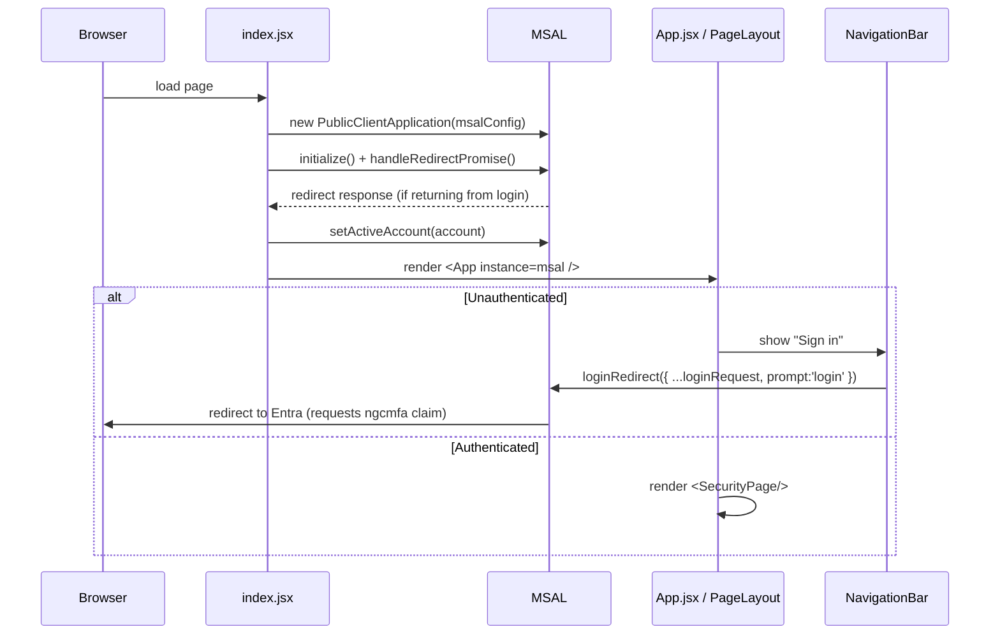
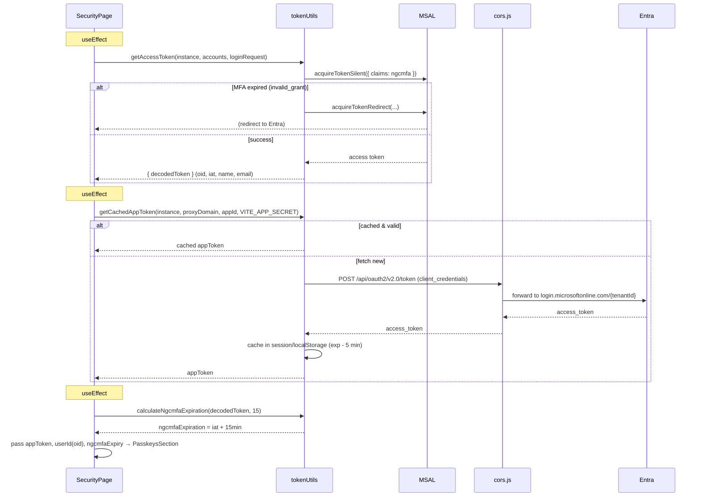
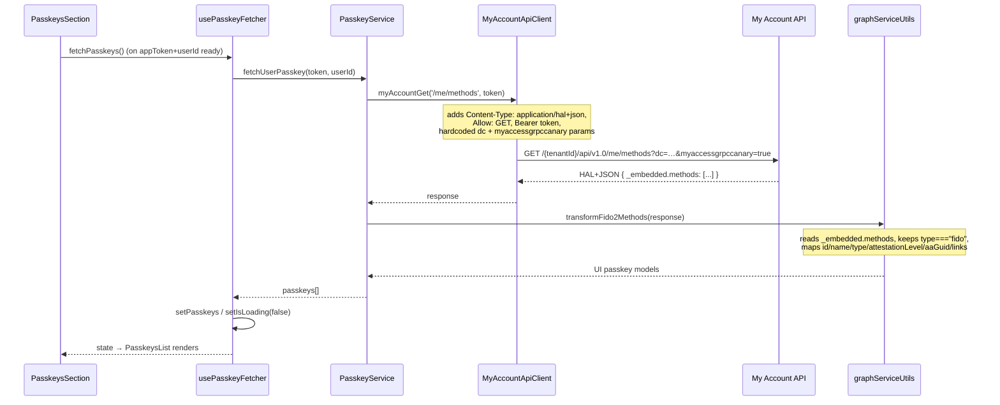
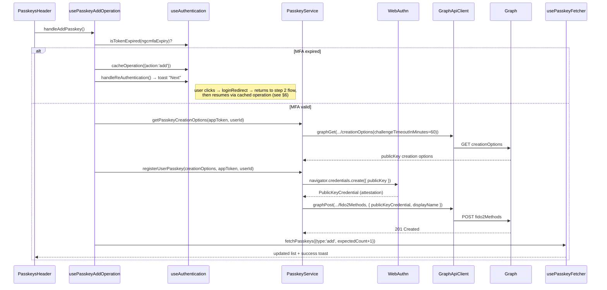
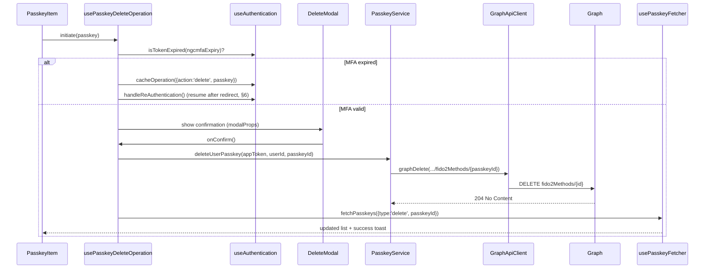
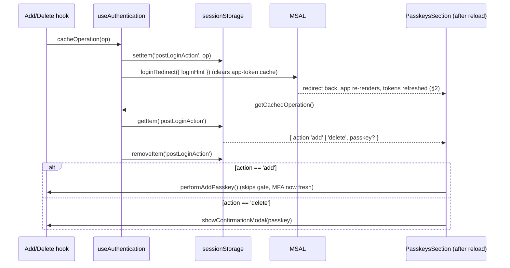
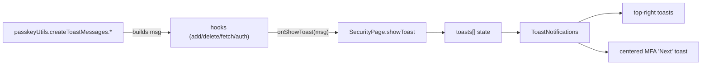

# Data Flows

This document shows the **runtime behaviour** of `passkey-sample` as sequence
diagrams. Read [ARCHITECTURE.md](./ARCHITECTURE.md) first for the static
structure and the two‑token model.

Participants used below:

* **Browser/UI** — React components (`SecurityPage`, `PasskeysSection`, sub‑components)
* **Hooks** — `useAuthentication`, `usePasskeyFetcher`, `usePasskeyAddOperation`, `usePasskeyDeleteOperation`
* **PasskeyService / GraphApiClient** — service layer
* **MSAL** — `@azure/msal-react` / `msal-browser`
* **Proxy** — `cors.js`
* **Entra** — `login.microsoftonline.com` token endpoint
* **Graph** — `graph.microsoft.com/beta` fido2Methods
* **WebAuthn** — `navigator.credentials` (browser authenticator / YubiKey)

---

## 1. App start‑up & sign‑in

`loginRequest` carries the `ngcmfa` amr claim so the resulting token proves a
recent MFA — this is what later gates passkey changes.

---

## 2. Token acquisition (SecurityPage on mount)

`SecurityPage` acquires **both** tokens and derives the user id + MFA expiry.

Key point: the **user token** yields `userId` (`oid`) and the **MFA expiry**; the
**app token** is the Bearer used for all Graph calls.

---

## 3. Fetch passkeys (initial load & refresh)

> **Migration note:** the list/GET now targets the **My Account API**
> (`login.microsoftonline.com/{tenantId}/api/v1.0/me/methods`) via
> `MyAccountApiClient`. The add/delete flows below still use Microsoft Graph and
> will be migrated in later steps.

`usePasskeyFetcher` also supports an **expected‑change** mode used after add/delete:
it retries (`MAX_RETRIES`, backoff) until the list reflects the change, smoothing
over API propagation delay.

---

## 4. Add passkey (with MFA gate + WebAuthn)

Notes:
* `createCredential` decodes `excludeCredentials` ids and base64url‑encodes the
  challenge/user id before calling WebAuthn; the attestation is re‑encoded to
  base64url for Graph.
* A user‑cancelled / timed‑out ceremony throws `NotAllowedError`, surfaced as a
  friendly "operation cancelled" toast.

---

## 5. Delete passkey (with MFA gate + confirm modal)

---

## 6. Re‑authentication & resuming a cached operation

When the MFA gate trips, the intended operation is stored and replayed after the
interactive sign‑in returns, so the user doesn't have to click twice.

---

## 7. Toast notifications (cross‑cutting)

All user feedback flows through a single queue owned by `SecurityPage`:

`createToastMessages` is the single source of toast copy (success, error,
session‑expired‑with‑action, etc.), keeping messaging consistent across hooks.
