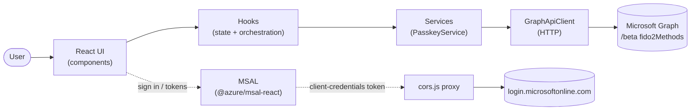

# Passkey Sample — Design Docs

These documents explain **how the `passkey-sample` app is structured** so a new
contributor can find their way around quickly. The app is a React SPA that lets a
signed‑in user **view, add, and delete passkeys (FIDO2 credentials)** on their
Microsoft Entra ID account using the Microsoft Graph
[`webauthnPublicKeyCredential` / `fido2AuthenticationMethod`](https://learn.microsoft.com/en-us/graph/api/resources/webauthnpublickeycredential?view=graph-rest-beta)
beta APIs.

> For setup/run instructions (tenant config, certs, hosts file, `npm` scripts) see
> the app [README](../README.md). These docs focus on **code structure and design**.

## How to read these docs

| Start here | Document | What it covers |
| ---------- | -------- | -------------- |
| 1 | **[ARCHITECTURE.md](./ARCHITECTURE.md)** | The big picture: where the app sits in the repo, the folder/file map, the layered architecture, and a reference of every module and the "classes"/functions it exports. |
| 2 | **[DATA-FLOWS.md](./DATA-FLOWS.md)** | The runtime behaviour: sequence diagrams for app start‑up, token acquisition, and the fetch / add / delete passkey flows (including the MFA re‑authentication gate). |

## 30‑second mental model

* **UI components** render state and capture intent — they hold no Graph logic.
* **Hooks** own state and orchestrate operations (fetch/add/delete + MFA gating).
* **Services** translate intent into Microsoft Graph calls and WebAuthn ceremonies.
* **`GraphApiClient`** is the single HTTP boundary to Graph; **utils** are pure helpers.
* **MSAL + `cors.js`** handle authentication and the client‑credentials token.

Read **ARCHITECTURE.md** next for the full map.
